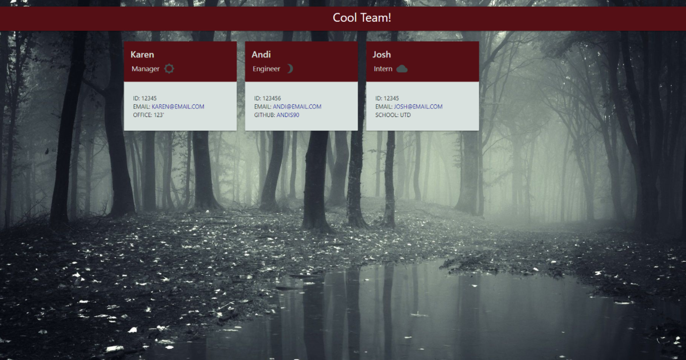

# Team-Profile-Generator
  
  
  
 
  ## Description:

   A Node.js command-line application that takes in information about employees on a software engineering team, then generates an HTML webpage that displays summaries for each person.
  
  Building this code required a core understanding of Node.js, the file system module, the Jest and Inquirer packages.
  

  ## Table of Contents
  
  - [Installation](#installation) <br>
  - [Usage](#usage) <br>
  - [Credits](#credits) <br>
  - [License](#license) <br>
  - [Contribute](#contributions) <br>
  - [Tests](#tests) <br>
  - [Questions](#questions) <br>
 
  <br>
  
  ## <span id="installation"> Installation: </span>
  <br>


 
  
  - Download the code via your preferred method, by clicking the green code button at the top of this page. 

  - If you don't have Node.js, you can install it [here](https://nodejs.org/en/download/).

  - Once you're sure the above steps are completed, the dependencies (Inquirer, Jest, and their sub-dependencies) are easily installed by navigating to the project's local directory within your command line and entering the below code:

```bash
npm i
```
 
  <br>
  
  ## <span id="usage"> Usage: </span>
  <br>

  [](https://www.youtube.com/watch?v=oNEmXUfHIlg) 
  
  - Once installed, and you've navigated to the local directory containing the application within your terminal, it may be invoked by using the following command:

```bash
node index.js
```

Your created html file will be stored in the dist folder under your team's name.

 
  
  <br>  
  
  ## <span id="credits"> Credits: <span>
  
  <br>
  
  - [Jest Docs](https://archive.jestjs.io/docs/en/22.x/getting-started)

  - [Node Docs](https://nodejs.org/en/docs/)

  - [Inquirer Docs](https://www.npmjs.com/package//inquirer#documentation)


  <br>
  
  ## <span id="license"> License </span>

<br>
MIT License

Copyright (c) 2021 AndiS90

Permission is hereby granted, free of charge, to any person obtaining a copy
of this software and associated documentation files (the "Software"), to deal
in the Software without restriction, including without limitation the rights
to use, copy, modify, merge, publish, distribute, sublicense, and/or sell
copies of the Software, and to permit persons to whom the Software is
furnished to do so, subject to the following conditions:

The above copyright notice and this permission notice shall be included in all
copies or substantial portions of the Software.

THE SOFTWARE IS PROVIDED "AS IS", WITHOUT WARRANTY OF ANY KIND, EXPRESS OR
IMPLIED, INCLUDING BUT NOT LIMITED TO THE WARRANTIES OF MERCHANTABILITY,
FITNESS FOR A PARTICULAR PURPOSE AND NONINFRINGEMENT. IN NO EVENT SHALL THE
AUTHORS OR COPYRIGHT HOLDERS BE LIABLE FOR ANY CLAIM, DAMAGES OR OTHER
LIABILITY, WHETHER IN AN ACTION OF CONTRACT, TORT OR OTHERWISE, ARISING FROM,
OUT OF OR IN CONNECTION WITH THE SOFTWARE OR THE USE OR OTHER DEALINGS IN THE
SOFTWARE. 
  
  <br>
  
  ## <span id="contributions"> To Contribute: </span>
 

  - Fork this repo, create a branch and have fun with it!

  or

  - [Report an Issue](https://github.com/AndiS90/Team-Profile-Generator/issues)

  or

  - [Make a Pull Request](https://github.com/AndiS90/Team-Profile-Generator/pulls)
  
  <br>
  
  ## <span id="tests"> Tests: </span>
  
  <br>
  
  
```bash
npm test
```

  <br>
  
  ## <span id="questions"> Questions: </span>
  
  <br>

  If you have questions I can be reached in the following manners below
  
  - [GitHub Profile](https://github.com/AndiS90)
  
  
  - [Email Me](andrea.strickland1990@gmail.com)
  
  <br>
